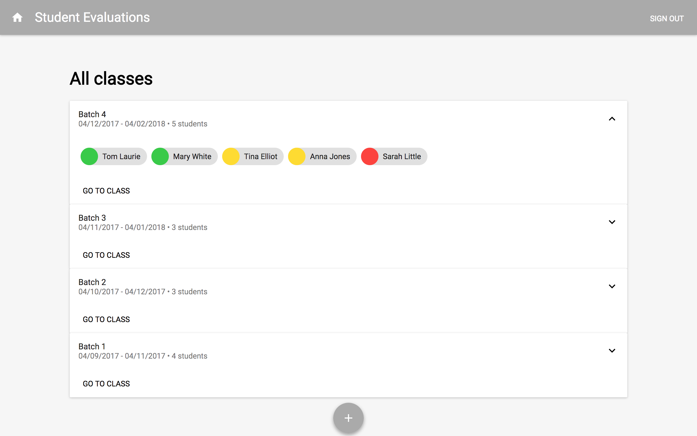
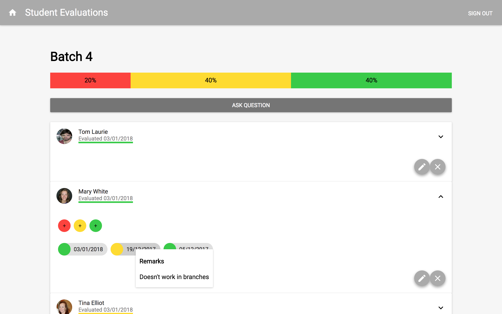
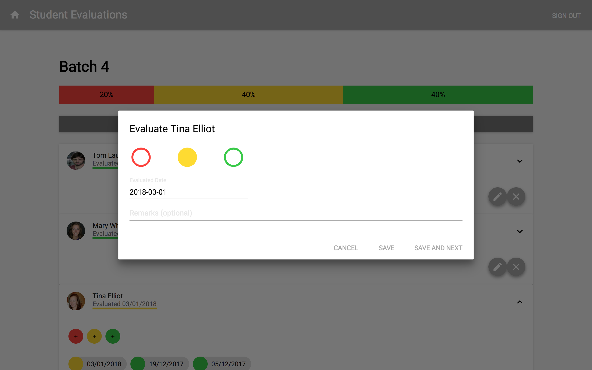
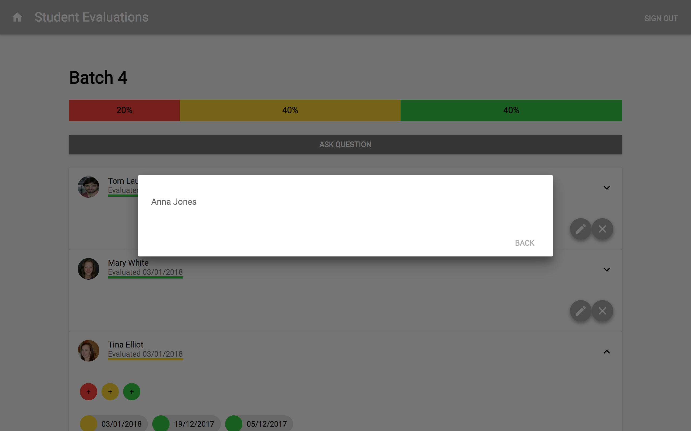

# Evaluation Tool

React frontend made as a final assignment for evaluation during week 7 of the 9-week Codaisseur Academy. The backend for this app can be found [here](https://github.com/Abohte/evaluation-tool-express).

This is an app that allows teachers to evaluate the performance of students, get an overview of the current state of evaluations per class and randomly select a student from that class to ask a question.

* Database: MongoDB
* Backend: Express
* Frontend: React.js

<p align="middle">


</p>
<p align="middle">


</p>

## Assignment

Creating a student evaluation tool, based on the following user stories:

### As a Teacher...
- I can sign into the tool with my email and password to start using it
- after I signed in, I see a (list of) current classes, identifiable by their Batch number (e.g. Batch #1), start date, and end date.
- I can create a new class by giving it a Batch number, start date, and end date.
- I can add, edit, remove students in a class. To add a student I need to provide: 1) their full name, 2) (a link to) their profile picture.
- I can click on a class, after which I see a grid of all the students by their name and photo, and the last colour code given to them. Above the students grid, I see a bar with 1-3 segments, showing me the percentage (%) of students evaluated GREEN, YELLOW, and RED.
- when I click on a photo or name, I can click on GREEN, YELLOW, or RED, fill in the date (defaults to today), and a remark. When I click “Save” it saves my evaluation, and takes me back to the student overview, when I click “Save and Next” it saves and shows me the next student.
- when I look at a student’s page, I can only fill in one evaluation per student per day. I can edit my own evaluations.
- from the class view I can click a button “ASK A QUESTION”. It shows me the name and picture of a random student to ask a question. Not entirely random though: RED students get ~47% of the questions YELLOW students ~32%, and GREEN students ~21%

## Running Locally

Make sure you have [Node.js](https://nodejs.org/en/) and [Yarn](https://yarnpkg.com/lang/en/) installed and the [backend](https://github.com/Abohte/evaluation-tool-express) running.

```bash
git clone git@github.com:Abohte/evaluation-tool-react.git
cd evaluation-tool-react
yarn install
yarn start
```
